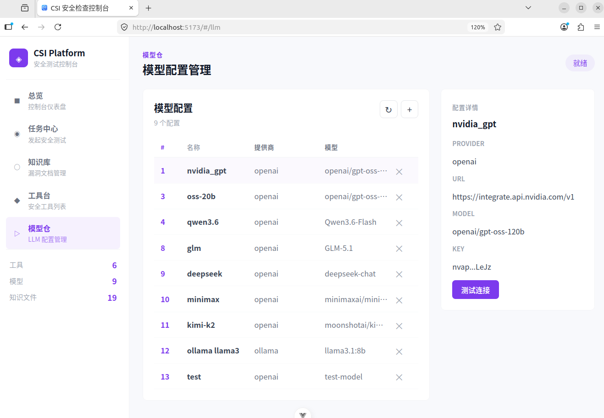
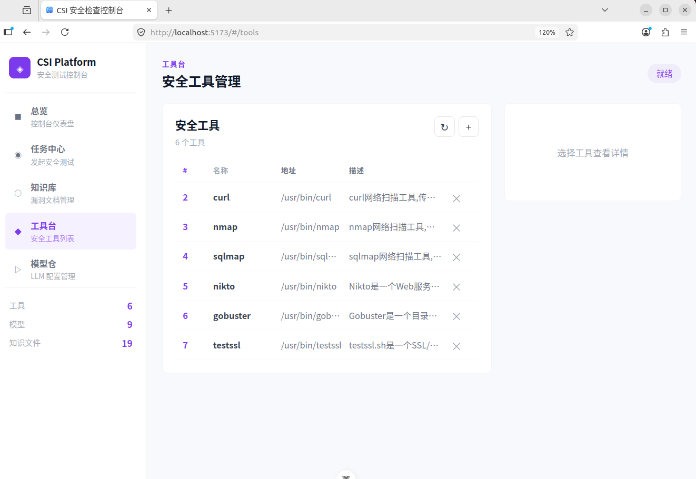
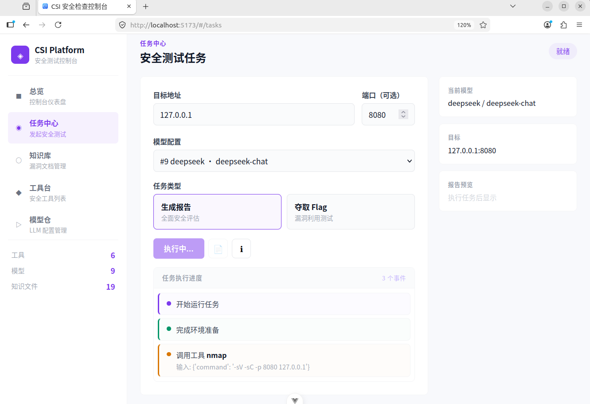
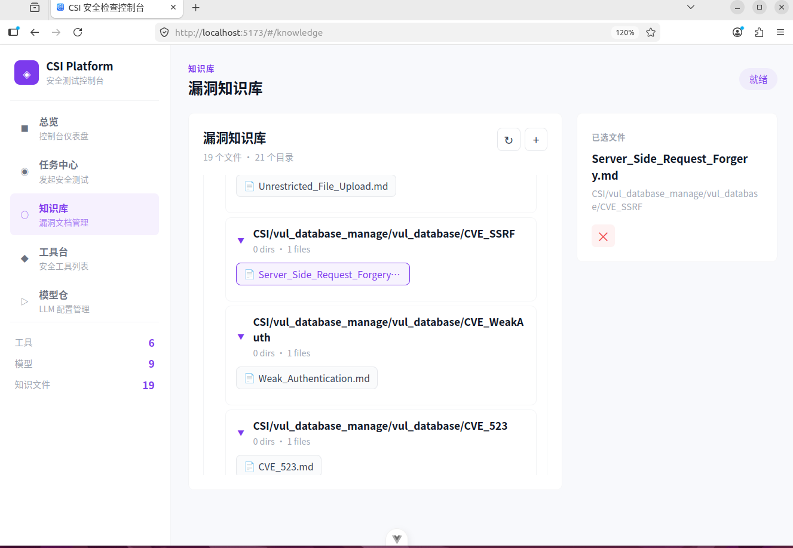

# CSI - Clever Security Inspection

基于大语言模型的自动化安全测试平台，利用 AI Agent 驱动渗透测试与漏洞评估。
An AI-powered automated security testing platform that leverages Large Language Models for penetration testing and vulnerability assessment.

## 功能特性 / Features

- **AI 驱动渗透测试** — 通过 LangChain Agent 自主调度安全工具并分析结果
  AI-driven penetration testing — LangChain agents autonomously execute security tools and analyze results

- **安全报告生成** — 自动生成结构化安全评估报告，包含 CVSS 评分和修复建议
  Security report generation — automatically generates structured reports with CVSS scores and remediation advice

- **CTF Flag 夺取** — 支持 CTF 挑战模式，自动识别和夺取 Flag
  CTF flag capture — supports CTF challenge mode to identify and capture flags

- **RAG 知识库** — 内置 CVE 漏洞知识库，基于 ChromaDB 向量数据库实现上下文安全分析（独立测试召回率 100%）
  RAG knowledge base — built-in CVE vulnerability knowledge base with ChromaDB (100% retrieval recall in standalone testing)

- **动态工具管理** — 通过 Web 界面增删改安全工具
  Dynamic tool management — add, edit, and remove security tools via the web interface

- **多模型支持** — 兼容任意 OpenAI 兼容 API（NVIDIA、DeepSeek、Ollama 等）
  Multi-model support — compatible with any OpenAI-compatible API endpoint

## 技术栈 / Tech Stack

| 组件 / Component | 技术 / Technology |
|------------------|-------------------|
| 后端 / Backend | Python, FastAPI, SQLAlchemy |
| AI 引擎 / AI Engine | LangChain + LangGraph, ChromaDB (RAG) |
| 前端 / Frontend | Vue 3, TypeScript, Vite |
| 数据库 / Database | SQLite |
| 嵌入模型 / Embedding | nvidia/nv-embed-v1 |

## 环境要求 / Requirements

- Python >= 3.10
- Node.js >= 20
- npm >= 10
- 安全工具 / Security tools：nmap, sqlmap, curl, gobuster, nikto, testssl
- OpenAI 兼容的 LLM API Key / An OpenAI-compatible LLM API key

## 快速开始 / Quick Start

### 1. 克隆仓库 / Clone the repository

```bash
git clone https://github.com/liminghjh/CSI.git
cd CSI
```

### 2. 后端启动 / Backend Setup

```bash
# 安装 Python 依赖 / Install Python dependencies
pip install -r requirements.txt

# 编辑 config.py，填入你的 API Key / Edit config.py and fill in your API keys

# 初始化 SQL 数据库 / Initialize the SQL database
python -m CSI.sql_database_manage.sql_database_use

# 初始化 RAG 向量数据库 / Initialize the RAG vector database
python -m CSI.vul_database_manage.vul_database

# 启动后端服务（端口 8000）/ Start the backend server (port 8000)
sudo -E python -m CSI.api.main_api
```

### 3. 前端启动 / Frontend Setup

```bash
cd CSI-fronter
npm install
npm run dev
```

打开浏览器访问 / Open http://localhost:5173 in your browser.

### 4. CLI 模式（可选）/ CLI Mode (alternative)

```bash
python -m CSI.main
```

按提示输入目标 IP 地址 / Enter the target IP address when prompted.

## 支持模型 / Supported Models

CSI 使用 OpenAI 兼容 API 接口，支持函数调用的模型均可接入。以下模型经过实验验证。
CSI uses an OpenAI-compatible API interface. Any model that supports OpenAI-style function calling can be integrated.

| 模型 / Model | API 提供商 / Provider | 实验表现 / Performance |
|-------------|----------------------|----------------------|
| **GPT-oss-120b** | NVIDIA API | 效率最优，仅 12 次工具调用完成检测，耗时 110.8s / Most efficient — 12 tool calls, 110.8s |
| **Qwen3.6-Flash** | scnet API | 覆盖度最优，检测 14 种漏洞类型，耗时 89.4s / Best coverage — 14 vulnerability types, 89.4s |
| **DeepSeek v4** | DeepSeek API | 稳定可靠，检测 13 种类型，耗时 235.7s / Stable — 13 types detected, 235.7s |
| **GLM-5.1** | scnet API | 完成全部任务但较慢（308.5s）/ Completed all tasks but slower (308.5s) |
| **Kimi-K2** | NVIDIA API | 不推荐，工具调用不稳定 / Not recommended — unstable tool calling |
| **Ollama（本地）** | localhost:11434 | 支持任意 Ollama 模型 / Supports any Ollama-served model |

## 功能截图 / Screenshots

### LLM 配置管理 / LLM Configuration

管理多种大语言模型配置，支持 NVIDIA API、DeepSeek、Ollama 等。
Manage multiple LLM configurations — supports NVIDIA API, DeepSeek, Ollama, and more.



### 安全工具管理 / Security Tool Management

通过界面增删改安全检测工具，工具信息存储在 SQLite 数据库中。
Add, edit, and remove security tools via the web interface. Tool data is stored in SQLite.



### 任务执行 / Task Execution

启动安全检测任务，Agent 自主调度工具并实时返回检测进度。
Launch security assessment tasks — the agent autonomously orchestrates tools and streams progress in real time.



### 漏洞知识库 / Vulnerability Knowledge Base

基于 RAG 的 CVE 漏洞知识库，支持上传、浏览和检索漏洞文档。
RAG-based CVE vulnerability knowledge base — supports uploading, browsing, and searching vulnerability documents.



## 配置说明 / Configuration

首次运行前编辑 `CSI/config.py` / Edit `CSI/config.py` before first run:

**必须配置嵌入模型（RAG 知识库需要）/ Embedding model is required (for RAG knowledge base)：**

```python
embedding_api_key = "your-api-key"
embedding_api_url = "https://integrate.api.nvidia.com/v1/embeddings"
embedding_model = "nvidia/nv-embed-v1"
```

**LLM 配置 — 仅 CLI 模式需要 / LLM config — only needed for CLI mode：**

Web 前端模式下，LLM 配置通过界面添加并存储在数据库中，无需修改 config.py。
In web frontend mode, LLM configurations are added through the UI and stored in the database — no need to edit config.py.

```python
# 以下仅 CLI 模式 (python -m CSI.main) 使用 / CLI mode only
api_key = "your-api-key"
api_url = "https://integrate.api.nvidia.com/v1"
api_model = "openai/gpt-oss-120b"
api_provider = "openai"
```

## API 端点 / API Endpoints

| 端点 / Endpoint | 方法 / Method | 说明 / Description |
|-----------------|--------------|-------------------|
| `/start_task` | POST | 启动安全检测任务（SSE 流式响应）/ Start security assessment (SSE streaming) |
| `/tool/` | CRUD | 管理安全工具 / Manage security tools |
| `/LLM/` | CRUD | 管理 LLM 配置 / Manage LLM configurations |
| `/vul_database/` | CRUD | 管理漏洞知识库 / Manage vulnerability knowledge base |

## 项目结构 / Project Structure

```
CSI/
├── api/                    # FastAPI 后端服务 / Backend server
├── LLM_api/                # LLM 集成层 / LLM integration
├── prompt/                 # Agent 系统提示词 / System prompts
├── sql_database_manage/    # SQLAlchemy 数据库层 / Database layer
├── tool_manage/            # 安全工具管理 / Security tool management
├── vul_database_manage/    # 漏洞知识库 / Vulnerability knowledge base
└── config.py               # 中心配置文件 / Central configuration

CSI-fronter/                # Vue 3 前端 / Vue 3 frontend
├── src/
│   ├── pages/              # 5 个应用页面 / 5 application pages
│   ├── components/         # 共享组件 / Shared components
│   ├── composables/        # 状态管理 / State management
│   └── api.ts              # API 客户端层 / API client
└── package.json
```

## 许可证 / License

本项目采用 Apache License 2.0 开源协议 — 详见 [LICENSE](LICENSE) 文件。
Licensed under the Apache License 2.0 — see the [LICENSE](LICENSE) file for details.
